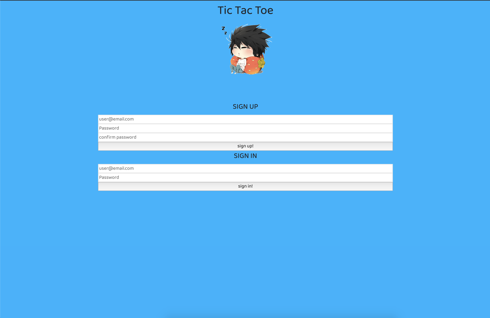
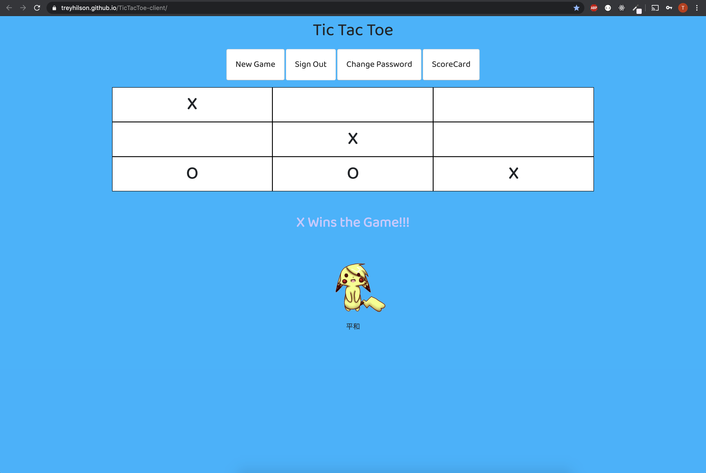
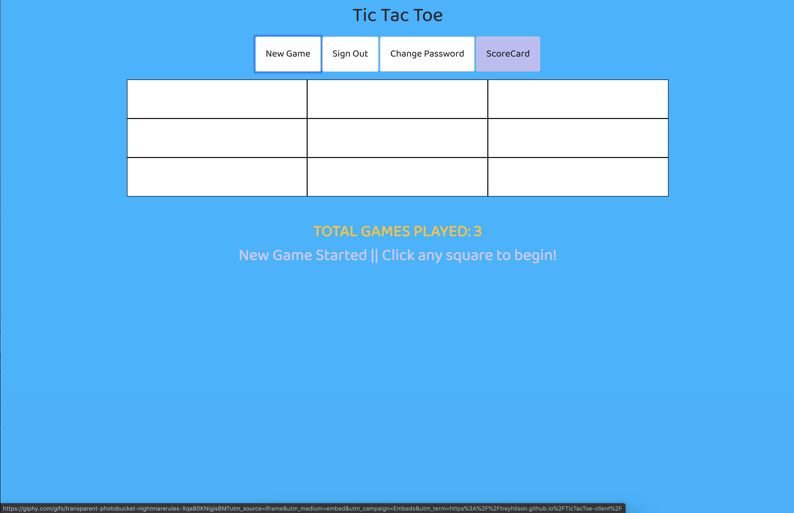

# Tic-Tac-Toe Game Project
ENJOY THE GAME HERE: 
#### https://treyhilson.github.io/TicTacToe-client/ ####

A game in which two players alternately put Xs and Os in compartments of a figure
 formed by two vertical lines crossing two horizontal lines and each tries to get
  a row of three Xs or three Os before the opponent does

## User Stories and Wireframe

[Wireframe Mockup Link]
https://imgur.com/4P7UNW0 || https://imgur.com/CdWt2Mi

* As a user, I want to sign up and create an account
* As a user, I want to be able to start a new game
* As a user, I want to see the that the game shows up as X and O as turns rotate
* As a user, I want to know whose turn it is next
* As a user, I want to see see a victor or a draw.
* As a user, I want to see the total number of games played during COVID-19.
* As a user, I want to be able to click on a button that will reset the gameboard
* As a user, I want to be able to change my password,
* As a user, I want to have the ability to sign out.

## Technologies Used

  * JavaScript
* jQuery
* API
* HTML
* SCSS (Sass)
* AJAX
* Bootstrap

## Development

Creating a Tic Tac Toe game is my project 0 with General Assembly.
I had never created a full front end functioning game before, and I
really enjoyed the process. Hours of problem solving enticed me to keep
learning more and to do better.
As you can see from my wireframe the design changed the more I focused on
functionality.
For example, I put "forgot password" on the button in my wireframe
design, but there was no need, only "change password" was needed.
Currently the game plays well for ver 1.0!

  ---*---
  In version 2.0
  I would like to create an intuitive feeling AI
  User can access how man wins & losses. 
